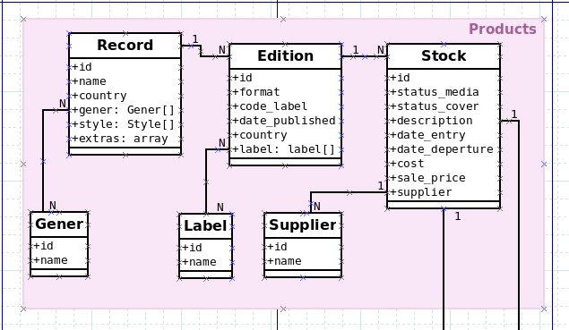

# Raspinu Office

---

#### Requerimientos

Gestión de stock / administrativo de discos de vinilo.

Record:

- Los discos se componen de una referencia esta puede ser null.
- Un mismo título puede tener diferentes ediciones por lo tanto diferentes referencias.
- Podemos tener varias unidades de una misma referencia con la particularidad que cada 
  unidad puede estar en un estado distinto, en el caso de los discos de segunda mano. 
  Por lo tanto cada unidad deberá tener un identificador único para definr esa unidad de stock especifica.
- El valor de producto (unidad de stock), varia en función de la edición/estado. Por lo tanto el precio 
  ha de especificarse de forma unitaria en cada unidad de stock.

---

### Testing

#### Psalm
Run Psalm: `./vendor/bin/psalm` 